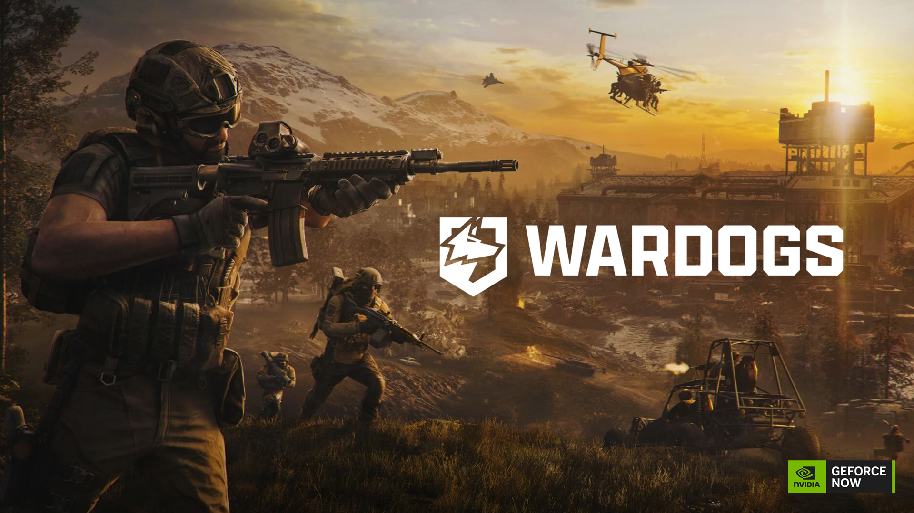

# Wardogs-FOV-ADS-Tweaks
FOV &amp; ADS tweaks for Wardogs (UE5) — optimal Field of View and ADS multiplier presets for competitive play. See more, aim better. Free.


[](https://github.com/IdentityCuckoo/Wardogs-FOV-ADS-Tweaks/releases/latest)
[](https://github.com/IdentityCuckoo/Wardogs-FOV-ADS-Tweaks/releases)
[](LICENSE)
[]()

**See more. Aim better. Win more.**

An optimized `Engine.ini` config for **Wardogs** (UE5) that sets the ideal Field of View and ADS multiplier for competitive play. Built for the 100-player chaos.

> **Current version:** `1.2.1` — Compatible with Early Access build (September 2026).


---

## ⬇️ Download

👉 **[Download the latest version](https://github.com/IdentityCuckoo/Wardogs-FOV-ADS-Tweaks/releases/latest)**

The installer is a single `Wardogs-FOV-ADS-Tweaks-Setup-v1.2.1.exe` file. Run it, follow the on-screen steps, done.

---

## ✨ Features

- **Optimal FOV presets** — 100, 105, or 110. Industry-standard values for awareness without making distant enemies too small. Wardogs allows FOV up to 120, but maximum is not automatically better[reference:0].
- **ADS Multiplier presets** — 0.85, 0.90, or 1.00. Recommended baseline is 1.00; lower values give slower, more precise aim while aiming down sights[reference:1].
- **PIP Scope disabled** — avoids rendering a second scene through magnified optics, improving performance[reference:2].
- **Read-only config protection** — prevents the game from overwriting your settings.
- **No performance impact.**
- **Achievement safe.**

---

## 🔧 Installation

1. Download the `Wardogs-FOV-ADS-Tweaks-Setup-v1.2.1.exe` installer from [Releases](https://github.com/IdentityCuckoo/Wardogs-FOV-ADS-Tweaks/releases/latest).
2. **Launch Wardogs once and close it.** This creates the config folder.
3. Run the installer.
4. Choose your FOV: `100`, `105`, or `110`.
5. Choose your ADS Multiplier: `0.85`, `0.90`, or `1.00`.
6. Follow the on-screen instructions.
7. Launch the game.

> **Windows SmartScreen warning?** Click "More info" → "Run anyway". The installer is unsigned.

---

## 🗑️ Uninstallation

Run the installer again and choose "Uninstall", or manually delete the modded files from:

```
%LOCALAPPDATA%\Wardogs\Saved\Config\WindowsClient
```

The game will recreate default configs on next launch.

---

## 🤝 Compatibility

| Mod type | Compatible | Notes |
|----------|:----------:|-------|
| FPS Boosters | ⚠️ | May conflict if both edit `Engine.ini` |
| In-game settings | ✅ | This mod overrides FOV/ADS values |
| Other `.ini` mods | ⚠️ | Only use one `Engine.ini` mod at a time |

> **Do not use together with other Engine.ini optimization mods.**

---

## ❓ FAQ

**Will this break my game?** No. `Engine.ini` is a standard UE5 config file. Delete it to revert.
**Will I get banned?** No. This is a client-side config file, not a cheat.
**What FOV should I pick?** `100` for balance, `105` for better awareness, `110` for maximum visibility.
**What ADS multiplier should I pick?** `1.00` is the recommended baseline. `0.85` or `0.90` give slower, more precise aim[reference:3].
**Does it work with the Steam version?** Yes.
**Can I change FOV later?** Yes — re-run the installer and pick a different value.

---

## 🙏 Credits

- **Author:** IdentityCuckoo
- **Game:** Wardogs by BULKHEAD / Team17
- **Engine:** Unreal Engine 5
- **Inspiration:** P40L0's Ultimate Engine Tweaks for UE5 games

---

## 📜 License

MIT — see [LICENSE](LICENSE).

---

## 🔍 Search Keywords

Wardogs FOV · Wardogs ADS · Wardogs FOV mod · Wardogs ADS multiplier · Wardogs sensitivity · Wardogs field of view · Wardogs aim down sights · Wardogs best FOV · Wardogs best settings · Wardogs competitive settings · Wardogs visibility · Wardogs config file · Wardogs Engine.ini · Wardogs GameUserSettings.ini · Wardogs FOV 95 · Wardogs FOV 100 · Wardogs FOV 105 · Wardogs FOV 110 · Wardogs FOV 120 · Wardogs PIP scope · Wardogs picture in picture scope · Wardogs scope mod · Wardogs aiming · Wardogs precision · Wardogs input lag · Wardogs low FPS · Wardogs optimization · Wardogs performance · Wardogs stutter fix · Wardogs tweaks · Wardogs mod · Wardogs nexus mods · Wardogs github · UE5 FOV mod · UE5 ADS mod · UE5 Engine.ini · Unreal Engine 5 tweaks · BULKHEAD · Team17 · Early Access · 100 player shooter · tactical FPS · extraction shooter · competitive FPS

### Other Games
Wardogs · The Blood of Dawnwalker · UE5 games · Unreal Engine 5 games
